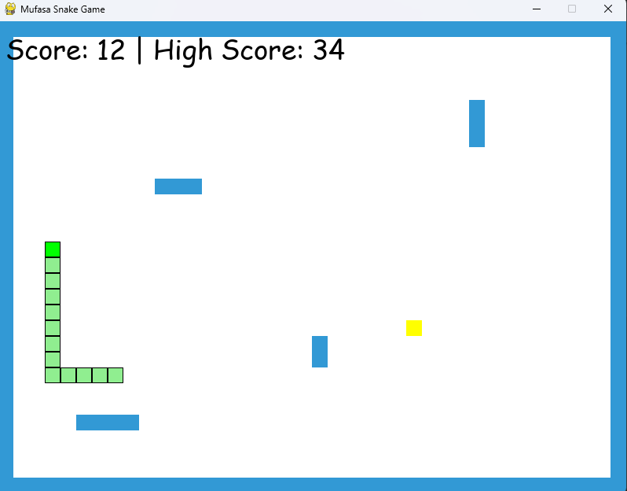

# Enhanced Snake Game 🐍

 *(Replace with actual screenshot if available)*

A modern twist on the classic Snake game featuring:
- Progressive difficulty levels
- High score tracking
- Wall obstacles
- Special food types with different effects

## Features ✨

### 🚀 Progressive Difficulty
- Game speed increases as you score more points
- Special speed-boost food temporarily increases game speed
- Slow-down food reduces speed for strategic play

### 🏆 High Score System
- Scores saved between game sessions
- Local high score tracking
- Always visible during gameplay

### 🧱 Wall Obstacles
- Border walls around the play area
- Random rectangular obstacles
- Collision detection with all barriers

### 🍎 Special Food Types
- **Normal (Red)**: +1 point
- **Speed Boost (Yellow)**: +3 points, temporary speed increase
- **Slow Down (Purple)**: +5 points, reduces game speed

## Installation ⚙️

### Requirements
- Python 3.x
- Pygame library

### Setup
1. Clone the repository:
   ```bash
   git clone https://github.com/AyiekoGershon/snake-game.git
   cd snake-game
   pip install pygame
   python snake_game.py

Controls 🎮

    Arrow Keys: Change snake direction

    Q: Quit when game over

    C: Continue/restart after game over

How to Play 🕹️

    Navigate the snake using arrow keys

    Eat food to grow longer

    Avoid walls, obstacles, and yourself

    Try different food types for special effects

    Beat your high score
Future Improvements 🔮

    Add sound effects

    Implement multiplayer mode

    Create different levels/maps

    Add power-ups (invincibility, score multipliers)

Contributing 🤝

Contributions are welcome! Please fork the repository and create a pull request.
License 📄

This project is licensed under the MIT License - see the LICENSE file for details.

Enjoy the game! 🎮
Created by AyiekoGershon
    
